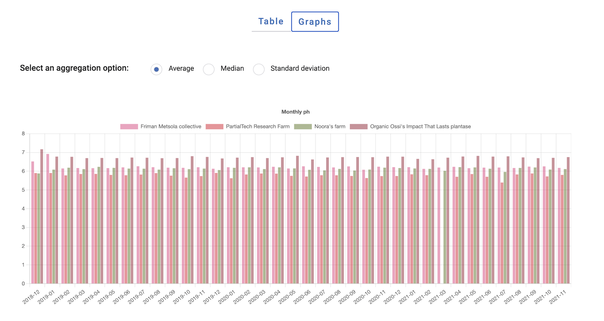
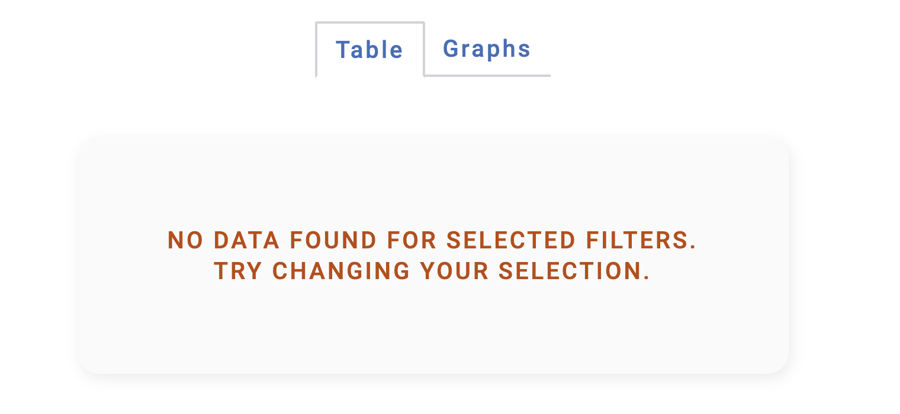

# Solita Dev Academy 2022 Assignment by Anastasiia Erokhina

This is a fullstack assignment for Solita's Dev Academy 2022 - a web application for displaying statistical data from different farms. Full description of the assignment can be found in the [assignment repository](https://github.com/solita/dev-academy-2022-exercise).

Because I've been mostly working with frontend technologies previously, the backend implementation is not too impressive and is my best effort based on some googling around.

## Features

The app receives statistical data from the backend and presents them to the user in table and graph forms. The user can filter the data by farm name and/or sensor type. The number and content of displayed graphs depends on selected filters and selected aggregations. If there's no data which satisfies the filters, the app shows a message about that to the user.

## Running the project

Prerequisites:

- [Docker](https://www.docker.com/)
- [docker-compose](https://docs.docker.com/compose/install/)

At the root of the repo there are two scripts:

- `start.sh` - builds Docker images for backend and frontend services and starts them. You will be able to access the frontend on http://localhost:3000. If you want to make raw requests to the backend, e.g. using `curl`, you can access it at http://localhost:8080.
- `stop.sh` - stops and removes all containers.

## Running tests

- Running the tests requires Node.js (tested with Node.js 16.13.1)
- Install required npm packages by running `npm install` in the project folder
- Run `npm run test`

## Used technologies

### Frontend

- JavaScript
- React.js
- Redux
- SCSS
- dayjs
- chartjs

### Backend

 - Python
 - FastAPI
 - MongoDB

 ## Notes

 Frontend part of this project assumes that the backend is accessible at http://backend:80 (as it is when running using docker-compose). To use it with the backend provided by Solita, change `"proxy": "http://backend:80/",` line in `package.json` to the address of Solita's backend (e.g. http://localhost:8080 if running it locally).
